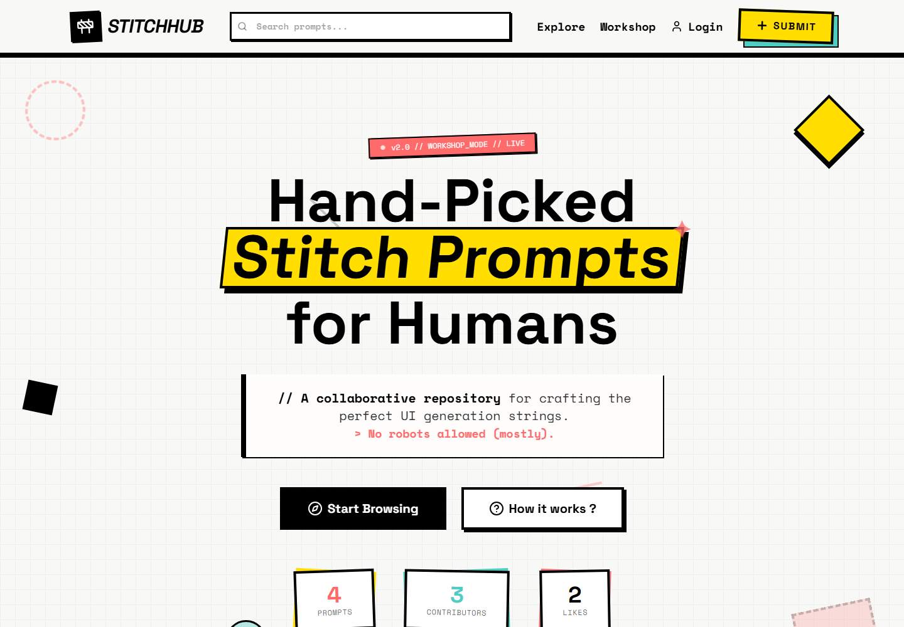

# STITCHHUB

### Hand-picked UI prompts, code and inspiration for humans.

[Visit the live experience](https://stitch-hub-one.vercel.app)

## What is StitchHub?

StitchHub is a visual discovery platform where designers, developers and AI creators can explore interface ideas together with the prompts and code behind them.

Instead of presenting designs as isolated images, StitchHub keeps the creative process attached to the final result. Every publication can become a practical reference for understanding how an interface was imagined and built.

## What does it offer?

- A curated gallery of interface designs and creative prompts.
- Publications with visuals, prompts and source-code snippets.
- Search and category filters for discovering relevant ideas.
- Multi-image galleries for presenting complete design concepts.
- Personal accounts and public creator profiles.
- Likes, saved designs and pinned collections.
- Creator following and realtime notifications.
- A responsive experience across desktop and mobile.

## Product foundations

### Discover

Browse community work through a visual feed designed to make exploration quick, expressive and enjoyable.

### Understand

See more than the finished image. Prompts and code provide useful context for learning from each design.

### Share

Publish complete ideas, organize personal work and build a public creator identity.

### Connect

Follow other creators, react to their work and receive updates through a lightweight social experience.

## Visual identity

StitchHub uses a neo-brutalist design language built around strong borders, offset shadows, high contrast, geometric shapes and playful motion. The interface is intentionally bold while remaining clear and usable.

## Technology

The experience is built with:

- Next.js and React
- TypeScript
- Tailwind CSS
- Supabase
- Framer Motion
- Vercel

## Live project

StitchHub is currently available at:

### [stitch-hub-one.vercel.app](https://stitch-hub-one.vercel.app)

## Author

A personal product created and maintained by [Luciano Nicolini](https://github.com/luchonicolini).

---

  <strong>Designed with bold strokes, thick borders and a little controlled chaos.</strong>

